<div align="center">
  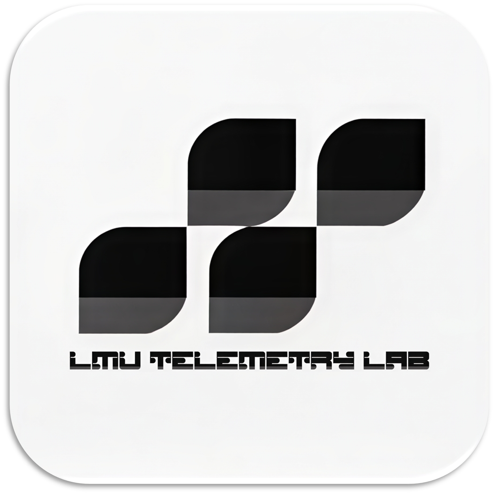
  <h1>LMU Telemetry Lab</h1>
  <p>A professional race telemetry analysis tool for <strong>Le Mans Ultimate</strong></p>
  <p>
    
    
    
    
  </p>
</div>

---

## ✨ Features

- 🖥️ **Maximized Analytics Dashboard** — Full-screen integrated engine for 2D/3D deep analysis
- 📊 **Telemetry Charts** — Multi-channel overlay with zoom, cursor sync, and lap comparison
- 🗺️ **2D / 3D Track Map** — GPS-based racing line with heatmap (throttle / brake / coast)
- 👻 **Ghost Car** — Visualize two laps simultaneously in 3D with position sync
- 🔄 **Cross-Session Reference Lap** — Compare laps across different sessions or stints
- 🎡 **Steering Wheel View** — Real-time steering angle with customizable wheel skins
- 📺 **Modular HUD System** — Reconfigurable, draggable overlays for live track & car data
- 💾 **Session Management** — Upload, rename, delete DuckDB sessions with multi-profile support
- 🧑‍💻 **Multi-Profile** — Individual accounts with separate data access and avatar
- ⚡ **Self-Healing Playback** — Auto-detects and corrects non-zero-start telemetry data

---

## 🏁 Telemetry Setup

To use this lab, you must first enable telemetry recording in **Le Mans Ultimate** to record telemetry data:

1.  Open **Le Mans Ultimate**.
2.  Go to **Settings** → **Controls** → **Gameplay**.
3.  Set **Telemetry Recording** to any bottom you like.
4.  Data will be saved to \Steam\steamapps\common\Le Mans Ultimate\UserData\Telemetry.

<p align="center">
  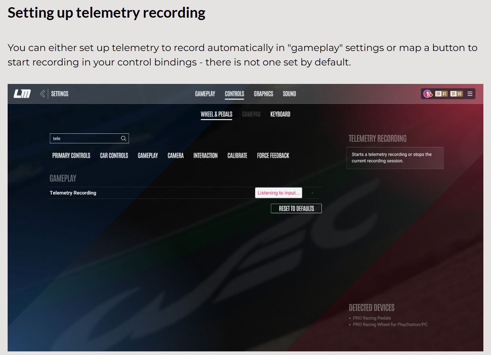
</p>

> 💡 For more detailed instructions, refer to the [Official LMU Telemetry Guide](https://guide.lemansultimate.com/hc/en-gb/articles/14524956311695-Telemetry-Recording).

---

## 📸 Screenshots

### 🏎️ Professional Analysis Dashboard
<p align="center">
  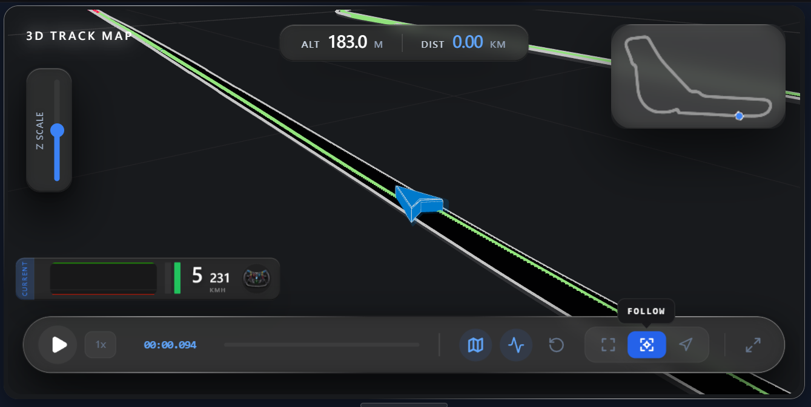
  <br/><em>Zero-lag 3D Track Map with Real-time Telemetry Overlay</em>
</p>

---

### 🛠️ Feature Focus

<p align="center"><b>1. Entry & Session Selection</b></p>
<table align="center">
  <tr>
    <td>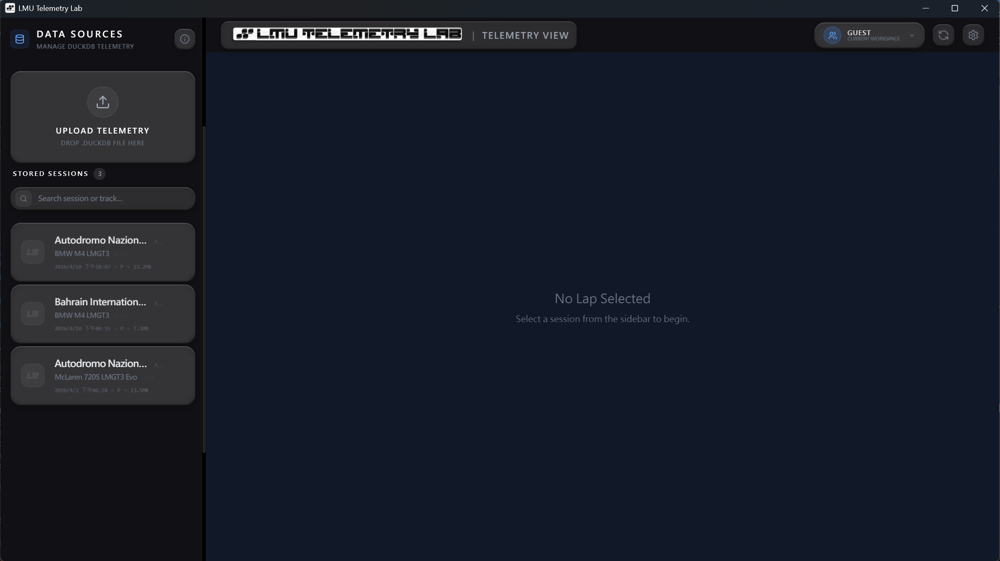</td>
    <td>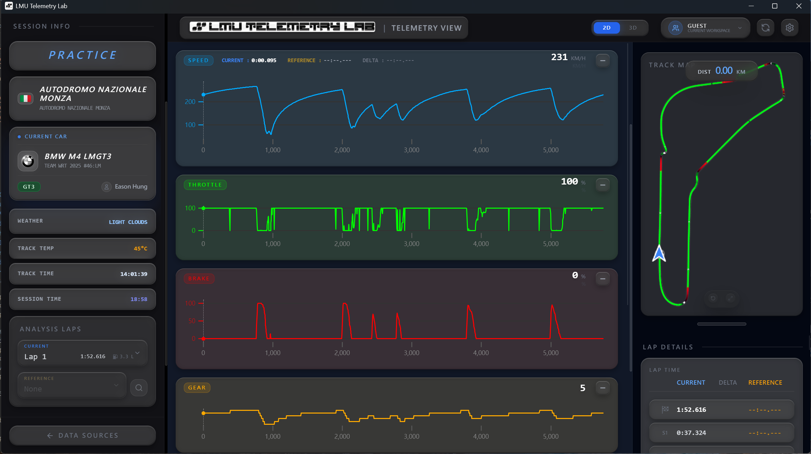</td>
  </tr>
</table>

<p align="center"><b>2. 2D Track Map Modes</b></p>
<table align="center">
  <tr>
    <td align="center"><b>Static View</b></td>
    <td align="center"><b>Follow View</b></td>
    <td align="center"><b>Heading-Up</b></td>
  </tr>
  <tr>
    <td>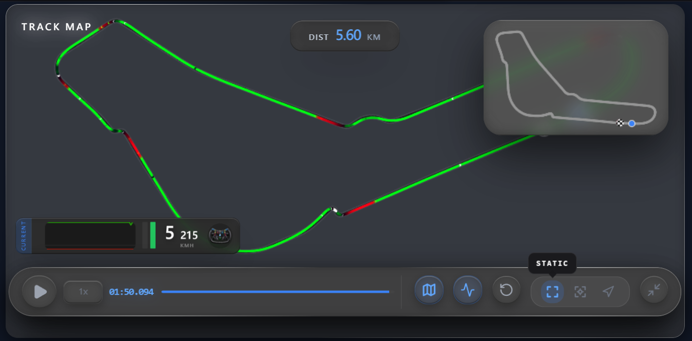</td>
    <td>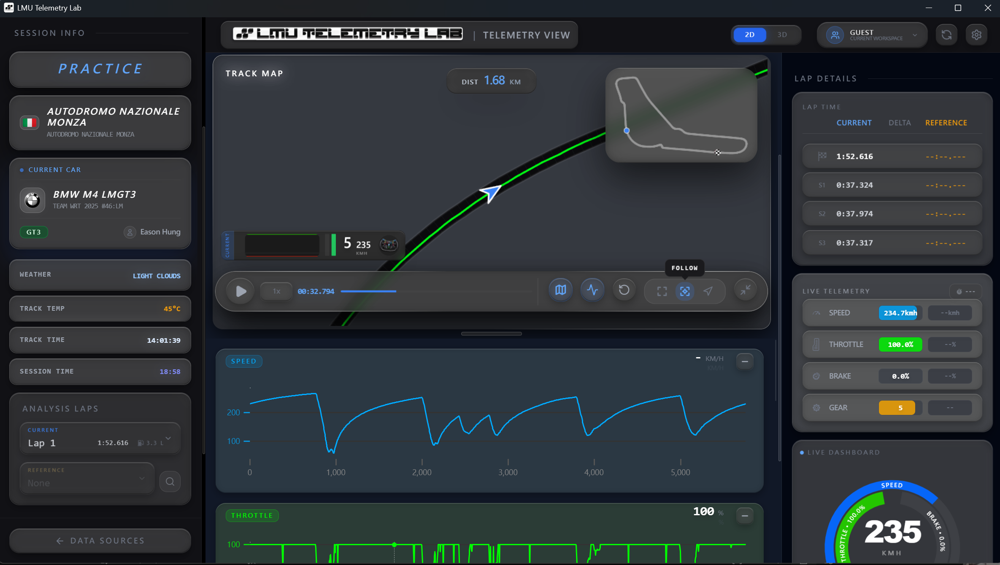</td>
    <td>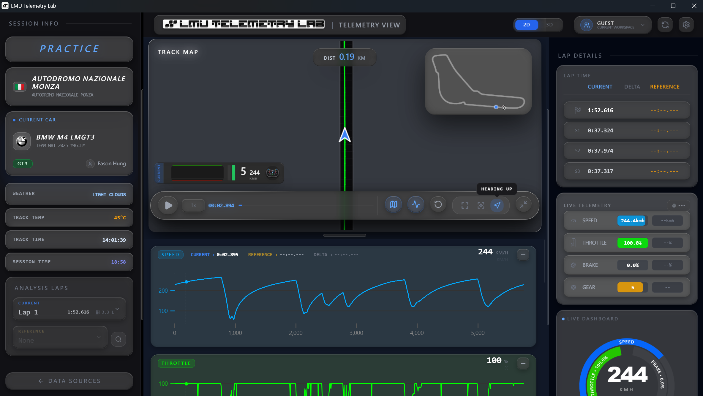</td>
  </tr>
</table>

<p align="center"><b>3. Advanced 3D Visualization</b></p>
<table align="center">
  <tr>
    <td align="center"><b>3D Follow View</b></td>
    <td align="center"><b>3D Heading-Up</b></td>
  </tr>
  <tr>
    <td></td>
    <td>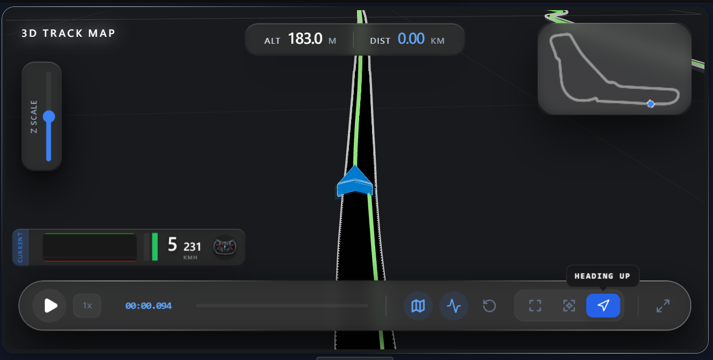</td>
  </tr>
</table>

<p align="center"><b>4. Cross-Session Reference Analysis</b></p>
<p align="center">
  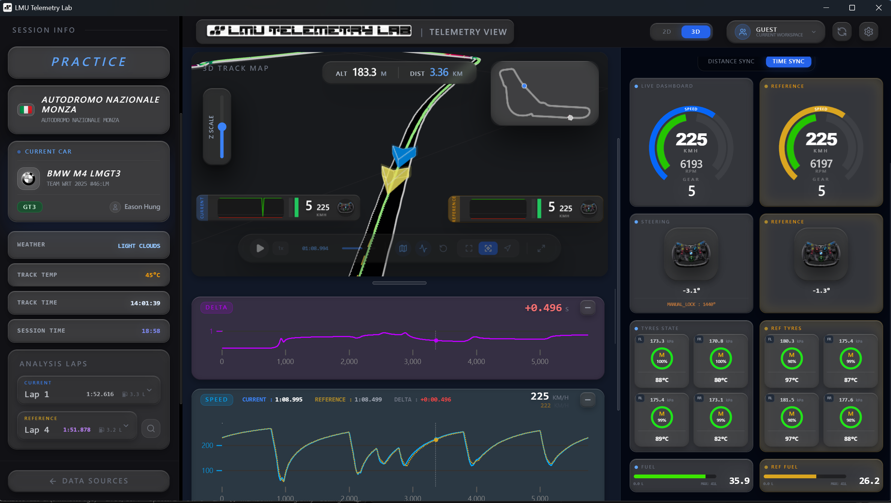
  <br/><em>Comparison with ghost car and live delta HUD</em>
</p>

<p align="center"><b>5. Personalization & Settings</b></p>
<table align="center">
  <tr>
    <td align="center"><b>User Profile</b></td>
    <td align="center"><b>Application Settings</b></td>
  </tr>
  <tr>
    <td>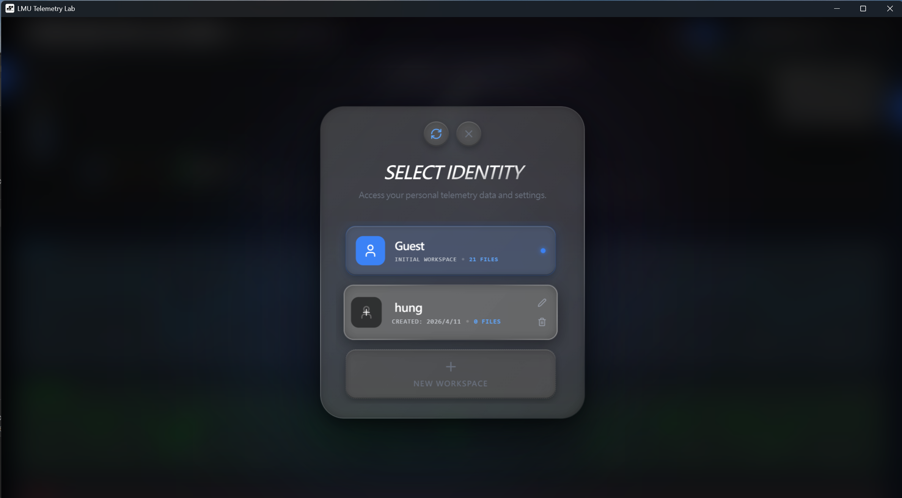</td>
    <td>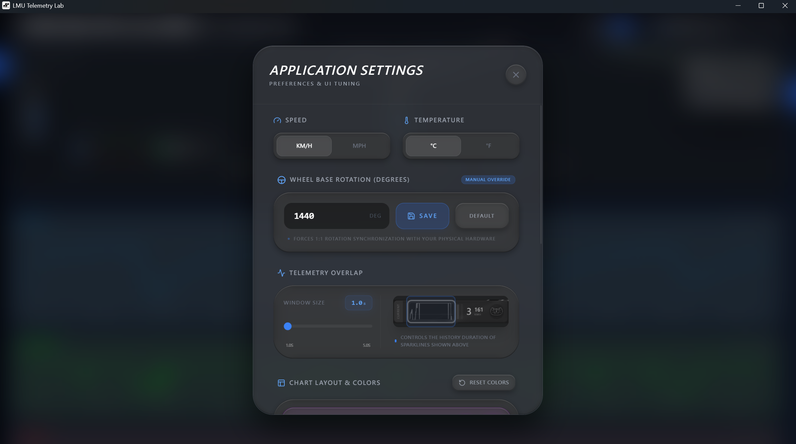</td>
  </tr>
</table>

---

## 📥 Installation

### Option A: Download the Installer (Recommended)

1. Go to the [**Releases**](../../releases) page
2. Download the latest `LMU Telemetry Lab Setup x.x.x.exe`
3. Run the installer and follow the on-screen steps
4. Launch **LMU Telemetry Lab** from the Start Menu or Desktop shortcut

> ⚠️ **Windows only.** If Windows SmartScreen shows a warning, click "More info" → "Run anyway".

### Option B: Run from Source (Dev Mode)

**Prerequisites:**
- Python 3.11+
- Node.js 18+
- Git

```bash
# 1. Clone the repo
git clone https://github.com/YOUR_USERNAME/lmu-telemetry-lab.git
cd lmu-telemetry-lab

# 2. Set up Python backend
python -m venv .venv
.venv\Scripts\activate
pip install -r backend/requirements.txt

# 3. Start the backend
cd backend
uvicorn main:app --reload

# 4. In another terminal, start the frontend
cd frontend
npm install
npm run dev
```

---

## 🛠️ Build the Installer

```bash
.\build_app.bat
```

The installer will be generated at `dist-electron/LMU Telemetry Lab Setup x.x.x.exe`.

---

## 🗂️ Project Structure

```
├── backend/              # FastAPI backend (Python)
│   ├── app/
│   │   ├── api/          # REST endpoints
│   │   └── services/     # Telemetry, Profiles, Car Lookup
│   └── main.py
├── frontend/             # React + Vite frontend (TypeScript)
│   └── src/
│       ├── components/   # UI components
│       └── store/        # Zustand state management
├── desktop/              # Electron shell
│   └── main.js
├── backend.spec          # PyInstaller spec
└── build_app.bat         # One-click build script
```

---

## 📋 Requirements

| Component | Requirement |
|-----------|-------------|
| OS | Windows 10 / 11 (x64) |
| Game | Le Mans Ultimate |
| Storage | ~500MB |
| RAM | 4GB+ recommended |

---

## 📝 Changelog

See [PROJECT_MILESTONES.md](PROJECT_MILESTONES.md) for the full version history.

---

## 📄 License

MIT License — see [LICENSE](LICENSE) for details.
